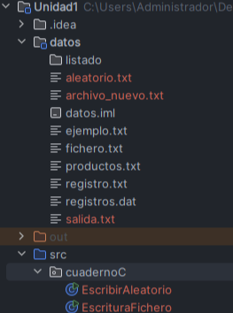
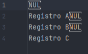
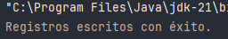
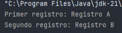

Cómo leer o escribir en partes específicas de un archivo sin tener que recorrerlo entero.  
Para eso usamos la clase RandomAccessFile, que nos permite mover un puntero dentro del archivo para leer o escribir justo donde queremos.

---

## Introducción

Cuando usamos lectura o escritura secuencial (como con FileReader o BufferedReader), los datos se procesan de principio a fin.  
Pero con el acceso aleatorio, podemos saltar directamente a una posición concreta del archivo y trabajar desde ahí.

Esto es muy útil, por ejemplo, si:

- Tenemos registros de datos con un tamaño fijo.  
      
    
- Queremos modificar un dato puntual sin leer todo el archivo.  
      
    

La clase RandomAccessFile permite tanto leer como escribir datos binarios o texto codificado, y tiene métodos específicos para moverse (seek()) y trabajar con diferentes tipos de datos (writeUTF(), readUTF(), etc.).

---

## Creación y escritura en un archivo aleatorio

RandomAccessFile se puede abrir en dos modos:

- "r" → solo lectura  
      
    
- "rw" → lectura y escritura  
      
    

Podemos movernos dentro del archivo con seek(long pos) y escribir con métodos como writeUTF().

### Ejemplo: Escribir varias líneas

```java
import java.io.*;

  

public class EscribirAleatorio {

    public static void main(String[] args) {

        try {

            RandomAccessFile raf = new RandomAccessFile("datos/aleatorio.txt", "rw");

  

            raf.writeUTF("Registro A");

            raf.writeUTF("Registro B");

            raf.writeUTF("Registro C");

  

            raf.close();

            System.out.println("Registros escritos con éxito.");

        } catch (IOException e) {

            System.out.println("Error: " + e.getMessage());

        }

    }

}

```
  
  






  

###  Que hace:

1. Se crea (o abre) el archivo aleatorio.txt en modo lectura/escritura ("rw").  
      
    
2. Se escriben tres cadenas: "Registro A", "Registro B" y "Registro C".  
      
    

- Cada una se guarda con writeUTF(), que usa un formato binario especial para cadenas.  
      
    

4. Se cierra el archivo y se muestra un mensaje de confirmación.  
      
    

Este programa guarda tres registros en un mismo archivo, uno detrás del otro.  
La diferencia es que luego podremos acceder directamente a cualquiera sin leer los anteriores.

---

## Lectura desde una posición específica

Podemos movernos dentro del archivo usando seek(pos), donde pos es el número de bytes desde el inicio.

### Ejemplo: Leer desde una posición concreta

```java
import java.io.*;

  

public class LeerAleatorio {

    public static void main(String[] args) {

        try {

            RandomAccessFile raf = new RandomAccessFile("datos/aleatorio.txt", "r");

  

            raf.seek(0); // leer desde el principio

            System.out.println("Primer registro: " + raf.readUTF());

  

            raf.seek(raf.getFilePointer()); // continuar donde se quedó

            System.out.println("Segundo registro: " + raf.readUTF());

  

            raf.close();

        } catch (IOException e) {

            System.out.println("Error: " + e.getMessage());

        }

    }

}
```

  



###  Explicación:

1. Se abre el archivo aleatorio.txt en modo lectura ("r").  
      
    
2. raf.seek(0) mueve el puntero al inicio del archivo.  
      
    
3. Se lee la primera cadena con readUTF() → muestra "Registro A".  
      
    
4. raf.getFilePointer() devuelve la posición actual, y se usa en seek() para continuar desde ahí.  
      
    
5. Luego lee el siguiente registro → "Registro B".  
      
    
6. Se cierra el archivo.  
      
    

 Este código lee registros uno a uno, pudiendo saltar directamente a donde queramos.  
Si conociéramos la posición exacta de un registro (por ejemplo, en bytes), podríamos ir directamente a él con seek(pos).

---

## Consideraciones 

- RandomAccessFile no usa buffer, por lo que si haces muchas operaciones seguidas puede ser más lento.  
      
    
- Los métodos writeUTF() y readUTF() no escriben texto plano, sino un formato binario con metadatos de longitud.  
      
    
- Si abres un archivo en modo "rw" y no existe, se crea automáticamente.  
      
    
- No se recomienda para archivos de texto normales, sino para archivos binarios estructurados o con registros de tamaño fijo.  
      
    

---

RandomAccessFile nos permite leer y escribir directamente en cualquier parte del archivo, sin recorrerlo todo.  
Es muy útil para trabajar con datos binarios o con estructuras de información que tienen posiciones conocidas.


| Método           | Descripción                                                   |
| ---------------- | ------------------------------------------------------------- |
| seek(pos)        | Mueve el puntero de lectura/escritura a una posición concreta |
| readUTF()        | Lee una cadena codificada en formato UTF                      |
| writeUTF(String) | Escribe una cadena en formato UTF                             |
| getFilePointer() | Devuelve la posición actual del puntero                       |
| length()         | Devuelve el tamaño total del archivo                          |

