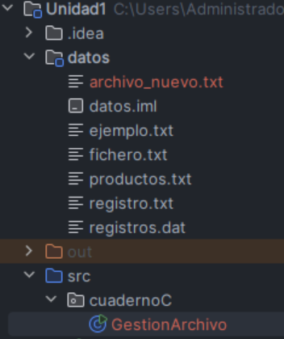
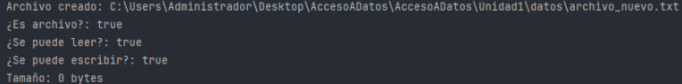
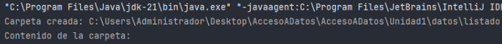
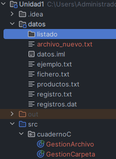

La clase File del paquete java.io, sirve para manejar archivos y carpetas en Java.  
Con ella podemos crear, borrar o comprobar si algo existe en el sistema de archivos, tanto si es un archivo como si es un directorio.

---

## Introducción

La clase File representa una ruta (path) hacia un archivo o carpeta.  
No se encarga de leer o escribir dentro de los archivos, sino de gestionar su existencia y propiedades.

Con File podemos:

- Saber si un archivo o carpeta existe.  
      
    
- Crear nuevos archivos o carpetas.  
      
    
- Eliminar archivos o carpetas.  
      
    
- Consultar su nombre, ruta, tamaño o permisos.  
      
    

---

## Crear y gestionar archivos

Primero, para trabajar con un archivo, creamos un objeto File que representa su ruta:

File archivo = new File("datos/ejemplo.txt");

  

Esto no crea el archivo, solo indica la ruta donde está (o estaría) ese archivo.

Algunos métodos útiles:

archivo.exists();          // Comprueba si existe

archivo.createNewFile();   // Crea el archivo si no existe

archivo.delete();          // Lo borra

archivo.getName();         // Devuelve el nombre

archivo.getPath();         // Ruta relativa

archivo.getAbsolutePath(); // Ruta completa

archivo.length();          // Tamaño en bytes

archivo.canRead();         // ¿Se puede leer?

archivo.canWrite();        // ¿Se puede escribir?

  

Ejemplo completo:

```java
import java.io.File;

import java.io.IOException;

  

public class GestionArchivo {

    public static void main(String[] args) {

        try {

            File archivo = new File("datos/archivo_nuevo.txt");

  

            if (!archivo.exists()) {

                archivo.createNewFile();

                System.out.println("Archivo creado: " + archivo.getAbsolutePath());

            } else {

                System.out.println("Ya existe: " + archivo.getAbsolutePath());

            }

  

            System.out.println("¿Es archivo?: " + archivo.isFile());

            System.out.println("¿Se puede leer?: " + archivo.canRead());

            System.out.println("¿Se puede escribir?: " + archivo.canWrite());

            System.out.println("Tamaño: " + archivo.length() + " bytes");

  

        } catch (IOException e) {

            System.out.println("Error: " + e.getMessage());

        }

    }

}
```



  
  
  
  
  

👉 En este programa, se crea un archivo nuevo si no existe y se muestran algunas de sus propiedades.

---

## Gestionar directorios

Para trabajar con carpetas, usamos también File.  
Podemos crear una carpeta, comprobar si existe o si es realmente un directorio:

File carpeta = new File("datos/nueva_carpeta");

carpeta.mkdir();        // Crea la carpeta

carpeta.exists();       // ¿Existe?

carpeta.isDirectory();  // ¿Es un directorio?

  

Si queremos ver qué hay dentro de una carpeta:

```java
String[] lista = carpeta.list();

for (String nombre : lista) {

    System.out.println(nombre);

}
```

  

Ejemplo:

```java
import java.io.File;

  

public class GestionCarpeta {

    public static void main(String[] args) {

        File carpeta = new File("datos/listado");

  

        if (!carpeta.exists()) {

            carpeta.mkdir();

            System.out.println("Carpeta creada: " + carpeta.getAbsolutePath());

        } else {

            System.out.println("Carpeta ya existente: " + carpeta.getAbsolutePath());

        }

  

        File[] contenido = carpeta.listFiles();

        System.out.println("Contenido de la carpeta:");

        if (contenido != null) {

            for (File f : contenido) {

                System.out.println("> " + f.getName() + (f.isDirectory() ? " (dir)" : ""));

            }

        }

    }

}
```

  
  
 
  



Este código crea una carpeta si no existe y luego muestra los archivos o subcarpetas que contiene.

---


La clase File se usa para interactuar con el sistema de archivos: crear, borrar, comprobar o listar elementos.  
No sirve para leer o escribir dentro de los archivos, pero es fundamental para manejar su estructura.


| Método            | Descripción                              |
| ----------------- | ---------------------------------------- |
| exists()          | Comprueba si el archivo o carpeta existe |
| createNewFile()   | Crea un archivo nuevo                    |
| mkdir()           | Crea una carpeta                         |
| delete()          | Elimina un archivo o carpeta             |
| isDirectory()     | Comprueba si es una carpeta              |
| isFile()          | Comprueba si es un archivo               |
| getName()         | Devuelve el nombre                       |
| getAbsolutePath() | Devuelve la ruta completa                |
| length()          | Tamaño en bytes                          |
| canRead()         | ¿Tiene permiso de lectura?               |
| canWrite()        | ¿Tiene permiso de escritura?             |

