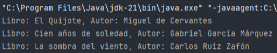
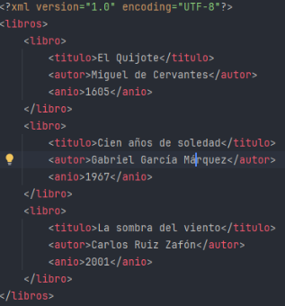
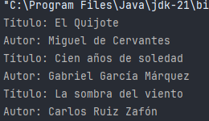

Se trata del manejo de ficheros XML en Java. Aprendemos a usar distintos modelos de análisis: DOM, SAX, StAX, así como APIs modernas: JAXP y JAXB.  
También se incluyen conceptos como XPath y el uso de POJOs para mapear estructuras XML.

---

## Introducción

- XML (eXtensible Markup Language) es un formato estándar para almacenar y transmitir datos estructurados.  
      
    
- Se utiliza mucho en interoperabilidad, configuraciones, intercambio de información y servicios web.  
      
    
- Java permite procesar XML en memoria (DOM) o evento a evento (SAX/StAX) según sea necesario.  
      
    

---

## Tecnologías para procesar XML en Java

| Tecnología | Descripción breve                          | Ventajas                              | Inconvenientes                         |
| ---------- | ------------------------------------------ | ------------------------------------- | -------------------------------------- |
| DOM        | Carga todo el XML en memoria como un árbol | Acceso aleatorio, permite modificar   | Alto consumo de memoria                |
| SAX        | Analiza XML como flujo de eventos          | Bajo consumo de memoria               | No permite modificar ni ir hacia atrás |
| StAX       | Lectura y escritura basada en eventos      | Control completo, combinación SAX/DOM | Código más complejo                    |
| JAXP       | API general para DOM o SAX                 | Flexible y estándar                   | Requiere conocer el modelo subyacente  |
| JAXB       | Mapea clases Java a XML y viceversa        | Muy productivo con anotaciones        | Requiere XSD y configuración previa    |
| XPath      | Lenguaje para buscar nodos dentro de XML   | Precisión, potente con DOM            | Solo lectura                           |

---

## Ejemplo de XML

```xml
<libros>

    <libro>

        <titulo>Java Avanzado</titulo>

        <autor>Juan Pérez</autor>

    </libro>

    <libro>

        <titulo>XML en Java</titulo>

        <autor>Ana Gómez</autor>

    </libro>

</libros>
```

  

---

## Lectura de XML con DOM

```java
import javax.xml.parsers.DocumentBuilderFactory;

import javax.xml.parsers.DocumentBuilder;

import org.w3c.dom.*;

import java.io.File;

  

public class LeerXML_DOM {

    public static void main(String[] args) {

        try {

            // Abrimos el archivo XML

            File archivo = new File("datos/libros.xml");

  

            // Creamos la fábrica y el builder de documentos

            DocumentBuilderFactory factory = DocumentBuilderFactory.newInstance();

            DocumentBuilder builder = factory.newDocumentBuilder();

  

            // Parseamos el archivo y obtenemos un objeto Document

            Document doc = builder.parse(archivo);

  

            // Obtenemos todos los nodos <libro>

            NodeList lista = doc.getElementsByTagName("libro");

  

            // Iteramos sobre cada libro

            for (int i = 0; i < lista.getLength(); i++) {

                Element libro = (Element) lista.item(i); // Convertimos Node a Element

                String titulo = libro.getElementsByTagName("titulo").item(0).getTextContent();

                String autor = libro.getElementsByTagName("autor").item(0).getTextContent();

                System.out.println("Libro: " + titulo + ", Autor: " + autor);

            }

  

        } catch (Exception e) {

            System.out.println("Error: " + e.getMessage());

        }

    }

}
```

  





  
### Que hace

- DOM carga todo el XML en memoria como un árbol.  
      
    
- Permite acceso aleatorio y modificación del documento.  
      
    
- Ideal para archivos pequeños o medianos, no para gigabytes.  
      
    

---

## Lectura de XML con SAX (evento a evento)

```java
import javax.xml.parsers.SAXParser;

import javax.xml.parsers.SAXParserFactory;

import org.xml.sax.*;

import org.xml.sax.helpers.DefaultHandler;

import java.io.File;

  

public class LeerXML_SAX {

    public static void main(String[] args) {

        try {

            // Abrimos el archivo XML

            File archivo = new File("datos/libros.xml");

  

            // Creamos el parser SAX

            SAXParserFactory factory = SAXParserFactory.newInstance();

            SAXParser parser = factory.newSAXParser();

  

            // Definimos un manejador de eventos

            DefaultHandler handler = new DefaultHandler() {

                boolean titulo = false;

                boolean autor = false;

  

                // Evento: cuando inicia un elemento

                public void startElement(String uri, String localName, String qName, Attributes attributes) {

                    if (qName.equals("titulo")) titulo = true; // Indicamos que estamos en <titulo>

                    if (qName.equals("autor")) autor = true;   // Indicamos que estamos en <autor>

                }

  

                // Evento: cuando se encuentran caracteres dentro de un nodo

                public void characters(char[] ch, int start, int length) {

                    if (titulo) {

                        System.out.println("Título: " + new String(ch, start, length));

                        titulo = false; // Reseteamos la bandera

                    }

                    if (autor) {

                        System.out.println("Autor: " + new String(ch, start, length));

                        autor = false;  // Reseteamos la bandera

                    }

                }

            };

  

            // Parseamos el archivo con el handler

            parser.parse(archivo, handler);

  

        } catch (Exception e) {

            System.out.println("Error SAX: " + e.getMessage());

        }

    }

}
```



### Que hace

- SAX no carga todo el XML en memoria, va procesando evento por evento.  
      
    
- Es más eficiente para archivos grandes.  
      
    
- No permite modificar el XML ni navegar hacia atrás.  
      


---

## Resumen y tips

- DOM: bueno para modificar y acceder aleatoriamente, pero usa mucha memoria.  
      
    
- SAX/StAX: eficiente en memoria, útil para lectura de archivos grandes.  
      
    
- JAXB: convierte XML a objetos Java (POJOs) y viceversa, muy cómodo.  
      
    
- XPath: permite consultas precisas dentro del XML, generalmente combinado con DOM.  
      

---

## Tabla comparativa


| Tecnología | Memoria | Modificación | Precisión | Complejidad |
| ---------- | ------- | ------------ | --------- | ----------- |
| DOM        | Alta    | Sí           | Media     | Baja        |
| SAX        | Baja    | No           | Media     | Media       |
| StAX       | Media   | Sí (eventos) | Alta      | Alta        |
| JAXB       | Media   | Sí (POJO)    | Alta      | Baja        |
| XPath      | Media   | No           | Muy alta  | Media       |

