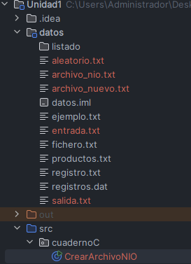
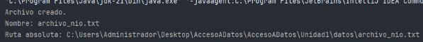
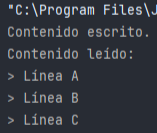
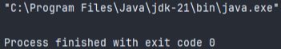

La API java.nio.file es la alternativa moderna a la clásica clase File. Introducida en Java 7, permite gestionar archivos y rutas de forma más clara, robusta y multiplataforma mediante las clases principales:

- Path: representa una ruta de archivo o directorio.  
      
    
- Paths: clase utilitaria para obtener objetos Path.  
      
    
- Files: contiene métodos estáticos para operaciones sobre archivos y directorios (leer, escribir, copiar, mover, borrar, etc.).  
      
    

Esta API soporta UTF-8, operaciones atómicas y se integra bien con streams de Java 8.

---

## Introducción a Java NIO

Java NIO (New Input/Output) es una evolución de Java I/O que mejora:

- Rendimiento (lectura/escritura por bloques en búferes).  
      
    
- Operaciones no bloqueantes (permite multitarea durante E/S).  
      
    
- Concurrencia en aplicaciones de red y manipulación de grandes volúmenes de datos.  
      
    

Conceptos clave:


| Concepto              | Descripción                                                                   | Ejemplo                           |
| --------------------- | ----------------------------------------------------------------------------- | --------------------------------- |
| Canales (Channel)     | Conexión con archivo, socket o dispositivo; permite lectura/escritura directa | FileChannel, SocketChannel        |
| Búferes (Buffer)      | Almacenan temporalmente datos para operaciones por bloques                    | ByteBuffer, CharBuffer, IntBuffer |
| Selectores (Selector) | Supervisan múltiples canales de forma no bloqueante                           | Servidores multicliente           |

Cuándo usar NIO:

- Servidores de red multicliente.  
      
    
- Archivos grandes o de alto rendimiento.  
      
    
- Procesos concurrentes o asíncronos de E/S.  
      
    

---

## Ejemplo básico: uso de Path y Files


```java
import java.nio.file.*;

  

public class CrearArchivoNIO {

    public static void main(String[] args) {

        try {

            Path ruta = Paths.get("datos/archivo_nio.txt");

  

            if (!Files.exists(ruta)) {

                Files.createDirectories(ruta.getParent());

                Files.createFile(ruta);

                System.out.println("Archivo creado.");

            } else {

                System.out.println("El archivo ya existe.");

            }

  

            System.out.println("Nombre: " + ruta.getFileName());

            System.out.println("Ruta absoluta: " + ruta.toAbsolutePath());

        } catch (Exception e) {

            System.out.println("Error: " + e.getMessage());

        }

    }

}

```
  



Explicación:

- Paths.get() crea un objeto Path que representa la ruta.  
      
    
- Files.createDirectories() asegura que existan los directorios padres.  
      
    
- Files.createFile() crea el archivo si no existe.  
      
    

---

## Lectura y escritura con Files y UTF-8

```java
import java.nio.file.*;

import java.util.List;

import java.nio.charset.StandardCharsets;

import java.io.IOException;

  

public class LecturaEscrituraNIO {

    public static void main(String[] args) {

        Path ruta = Paths.get("datos/nio_contenido.txt");

  

        try {

            List<String> lineas = List.of("Línea A", "Línea B", "Línea C");

            Files.write(ruta, lineas, StandardCharsets.UTF_8);

            System.out.println("Contenido escrito.");

  

            List<String> leidas = Files.readAllLines(ruta, StandardCharsets.UTF_8);

            System.out.println("Contenido leído:");

            for (String linea : leidas) {

                System.out.println("> " + linea);

            }

        } catch (IOException e) {

            System.out.println("Error: " + e.getMessage());

        }

    }

}
```

  



Puntos clave:

- Files.write() escribe líneas de texto en UTF-8.  
      
    
- Files.readAllLines() lee todas las líneas del archivo en una lista.  
      
    

---

## Ejemplo con canal y búfer

```java
import java.nio.file.*;

import java.nio.channels.SeekableByteChannel;

import java.nio.ByteBuffer;

import java.io.IOException;

  

public class NIOExample {

    public static void main(String[] args) throws IOException {

        Path path = Paths.get("miArchivo.txt");

  

        try (SeekableByteChannel channel = Files.newByteChannel(path, StandardOpenOption.WRITE, StandardOpenOption.CREATE)) {

            byte[] data = "Hola, mundo!".getBytes();

            ByteBuffer buffer = ByteBuffer.wrap(data);

            channel.write(buffer);

        }

    }

}

```
  



Explicación:

- Se usa SeekableByteChannel para escritura eficiente.  
      
    
- ByteBuffer almacena los datos temporalmente antes de escribirlos en bloque.  
      
    

---

## Ventajas de NIO frente a File


| Característica     | File               | Path + Files (NIO)                  |
| ------------------ | ------------------ | ----------------------------------- |
| Manejo de rutas    | Limitado           | Flexible, multiplataforma           |
| Crear archivos     | .createNewFile()   | Files.createFile(path)              |
| Leer/escribir todo | No nativo          | Files.readAllLines(), Files.write() |
| UTF-8 por defecto  | No                 | Sí, configurable                    |
| Streams            | No                 | Sí (Files.lines(), Files.walk())    |
| Seguridad          | Menos validaciones | Más chequeos y robustez             |

---

## Buenas prácticas con NIO

1. Usar Paths y Files en lugar de File para mayor seguridad y portabilidad.  
      
    
2. Manejar excepciones de I/O con try-catch.  
      
    
3. Aprovechar UTF-8 para compatibilidad internacional.  
      
    
4. Para archivos grandes, usar canales y búferes en lugar de readAllLines().  
      
    
5. Cerrar recursos automáticamente con try-with-resources.  
      
    

---

## Actividad práctica

Objetivo: Crear un sistema de gestión de archivos de texto usando NIO.

Pasos:

1. Crear un archivo registro.txt si no existe.  
      
    
2. Escribir líneas de registro de usuarios (nombre, correo).  
      
    
3. Leer y mostrar todas las entradas del archivo.  
      
    
4. Utilizar Files.write() y Files.readAllLines() con UTF-8.  
      
    
5. Implementar manejo de errores con try-catch.  
      
    

Bonus: Usar Files.lines() para procesar el archivo con streams de Java 8.

---


- Java NIO es la evolución moderna de I/O en Java.  
      
    
- Permite trabajar con archivos y rutas de forma eficiente, segura y multiplataforma.  
      
    
- Las clases clave son Path, Paths y Files.  
      
    
- Ideal para aplicaciones concurrentes, de alto rendimiento o que manejen grandes volúmenes de datos.  
      
    
- Aunque requiere un poco más de aprendizaje, sus ventajas sobre la clase File clásica son evidentes.
    

