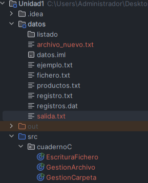
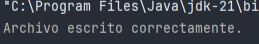
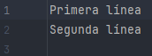
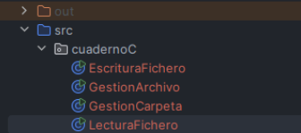
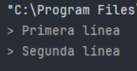

Trata de leer y escribir archivos de texto en Java de forma secuencial, desde el principio hasta el final, línea por línea o carácter por carácter.

Para hacerlo, usamos las clases del paquete java.io:

- FileReader y BufferedReader para leer archivos.  
      
    
- FileWriter y BufferedWriter para escribir archivos.  
      
    

---

## Introducción

La lectura y escritura secuencial significa que el programa lee o escribe los datos en orden, desde el inicio hasta el final del archivo.  
Este método se usa cuando queremos procesar texto de manera simple, por ejemplo, leer un archivo línea a línea o escribir frases completas.

Java ofrece varias clases para hacerlo más rápido y eficiente.  
Las clases “Buffered” usan una memoria intermedia (un buffer) que acumula datos antes de escribirlos o leerlos del disco, reduciendo el tiempo de acceso y mejorando el rendimiento.

---

## Escritura secuencial de ficheros

Para escribir texto en un archivo se usan dos clases principales:

- FileWriter → conecta el programa con el archivo donde se va a escribir.  
      
    
- BufferedWriter → agrupa la escritura en bloques, lo que la hace más rápida y eficiente.  
      
    

Ejemplo:

```java

import java.io.*;

  

public class EscrituraFichero {

    public static void main(String[] args) {

        try {

            FileWriter fw = new FileWriter("datos/salida.txt");

            BufferedWriter bw = new BufferedWriter(fw);

  

            bw.write("Primera línea");

            bw.newLine();

            bw.write("Segunda línea");

            bw.newLine();

  

            bw.flush(); // Forzar la escritura

            bw.close(); // Cerrar el buffer

  

            System.out.println("Archivo escrito correctamente.");

        } catch (IOException e) {

            System.out.println("Error al escribir: " + e.getMessage());

        }

    }

}
```

  





  

Qué hace el código:

1. Crea o abre el archivo datos/salida.txt.  
      
    
2. Escribe dos líneas de texto.  
      
    
3. Usa flush() para asegurarse de que todo se guarda en el disco.  
      
    
4. Cierra el archivo correctamente con close().  
      
    

---

## Lectura secuencial de ficheros

Para leer un archivo de texto línea a línea se usan estas clases:

- FileReader → abre el archivo para leerlo.  
      
    
- BufferedReader → permite leer una línea completa con el método readLine().  
      
    

Ejemplo:

```java
import java.io.*;

  

public class LecturaFichero {

    public static void main(String[] args) {

        try {

            FileReader fr = new FileReader("datos/salida.txt");

            BufferedReader br = new BufferedReader(fr);

  

            String linea;

            while ((linea = br.readLine()) != null) {

                System.out.println("> " + linea);

            }

  

            br.close();

        } catch (IOException e) {

            System.out.println("Error al leer: " + e.getMessage());

        }

    }

}

```
  




 
 Qué hace este código:

1. Abre el archivo datos/salida.txt.  
      
    
2. Lee cada línea con readLine() hasta llegar al final (null).  
      
    
3. Muestra el contenido en pantalla.  
      
    
4. Cierra el archivo para liberar recursos.  
      
    

---

## Consideraciones importantes

- Cerrar los streams: Siempre usa close() para liberar memoria y asegurar que los datos se guarden.  
      
    
- Controlar errores: Usa try-catch para manejar posibles fallos (como rutas incorrectas).  
      
    
- Usar flush(): Garantiza que los datos en el buffer se escriban en el archivo.  
      
    
- Verificar rutas: Asegúrate de que las carpetas existan antes de escribir.  
      
    
- Usar newLine(): Es mejor que \n porque funciona igual en todos los sistemas operativos.  
      
    

---


Estas clases permiten guardar y leer información de archivos de texto de forma sencilla.  
Son ideales para programas que necesitan guardar datos pequeños o leer configuraciones.


| Clase          | Función                                          |
| -------------- | ------------------------------------------------ |
| FileWriter     | Escribe caracteres en un archivo                 |
| BufferedWriter | Hace la escritura más eficiente usando un buffer |
| FileReader     | Lee caracteres desde un archivo                  |
| BufferedReader | Permite leer líneas completas fácilmente         |


