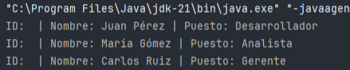
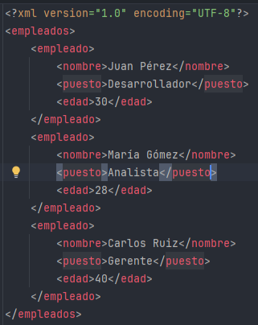
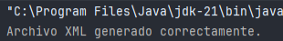

- DOM representa un XML como un árbol jerárquico de nodos.  
      
    
- Cada elemento, atributo o contenido de texto es un nodo.  
      
    
- Permite acceso aleatorio, lectura, modificación y escritura.  
      
    
- Se trabaja con JAXP: javax.xml.parsers, org.w3c.dom, javax.xml.transform.  
      
    

---

## Clases principales


| Clase                  | Descripción                                         |
| ---------------------- | --------------------------------------------------- |
| DocumentBuilderFactory | Fabrica que crea parsers DOM                        |
| DocumentBuilder        | Construye un objeto Document desde un archivo       |
| Document               | Representa todo el XML en memoria                   |
| Node                   | Nodo genérico base de todos los elementos           |
| Element                | Nodo que representa una etiqueta XML                |
| Attr                   | Nodo que representa un atributo de un elemento      |
| Text                   | Nodo que contiene texto dentro de un elemento       |
| TransformerFactory     | Fabrica para generar transformadores de XML         |
| Transformer            | Permite escribir el Document a un archivo de salida |

---

## Lectura de un XML con DOM

```java
import javax.xml.parsers.*;

import org.w3c.dom.*;

import java.io.File;

  

public class DOMLeerEjemplo {

    public static void main(String[] args) {

        try {

            // Abrimos el archivo XML

            File archivo = new File("datos/empleados.xml");

  

            // Creamos la fábrica de DocumentBuilder

            DocumentBuilderFactory dbf = DocumentBuilderFactory.newInstance();

            DocumentBuilder db = dbf.newDocumentBuilder();

  

            // Parseamos el archivo XML y obtenemos un Document

            Document doc = db.parse(archivo);

  

            // Obtenemos todos los nodos <empleado>

            NodeList lista = doc.getElementsByTagName("empleado");

  

            // Iteramos sobre cada empleado

            for (int i = 0; i < lista.getLength(); i++) {

                Element emp = (Element) lista.item(i); // Convertimos Node a Element

                String id = emp.getAttribute("id");    // Leemos atributo 'id'

                String nombre = emp.getElementsByTagName("nombre").item(0).getTextContent();

                String puesto = emp.getElementsByTagName("puesto").item(0).getTextContent();

  

                System.out.println("ID: " + id + " | Nombre: " + nombre + " | Puesto: " + puesto);

            }

  

        } catch (Exception e) {

            System.out.println("Error al leer: " + e.getMessage());

        }

    }

}
```



### Que hace

- DOM carga todo el XML en memoria, creando un árbol jerárquico.  
      
    
- getElementsByTagName permite acceder a nodos específicos.  
      
    
- getAttribute lee atributos de un elemento.  
      
    
- Ideal para archivos pequeños o medianos que necesitamos recorrer varias veces o modificar.  


---

## Escritura de un XML con DOM

```java
import javax.xml.parsers.*;

import javax.xml.transform.*;

import javax.xml.transform.dom.DOMSource;

import javax.xml.transform.stream.StreamResult;

import org.w3c.dom.*;

import java.io.File;

  

public class DOMEscribirEjemplo {

    public static void main(String[] args) {

        try {

            // Creamos un Document vacío

            DocumentBuilderFactory dbf = DocumentBuilderFactory.newInstance();

            DocumentBuilder db = dbf.newDocumentBuilder();

            Document doc = db.newDocument();

  

            // Creamos el nodo raíz <empleados>

            Element root = doc.createElement("empleados");

            doc.appendChild(root);

  

            // Creamos un nodo <empleado>

            Element emp = doc.createElement("empleado");

            emp.setAttribute("id", "E001"); // Asignamos atributo

  

            // Creamos nodo <nombre> y añadimos texto

            Element nombre = doc.createElement("nombre");

            nombre.appendChild(doc.createTextNode("Ana Torres"));

            emp.appendChild(nombre);

  

            // Creamos nodo <puesto> y añadimos texto

            Element puesto = doc.createElement("puesto");

            puesto.appendChild(doc.createTextNode("Desarrolladora"));

            emp.appendChild(puesto);

  

            // Añadimos el empleado al nodo raíz

            root.appendChild(emp);

  

            // Preparamos el transformador para escribir el XML

            TransformerFactory tf = TransformerFactory.newInstance();

            Transformer transformer = tf.newTransformer();

            DOMSource source = new DOMSource(doc);

            StreamResult result = new StreamResult(new File("datos/empleados_generado.xml"));

  

            // Guardamos el XML en el archivo

            transformer.transform(source, result);

  

            System.out.println("Archivo XML generado correctamente.");

  

        } catch (Exception e) {

            System.out.println("Error al escribir: " + e.getMessage());

        }

    }

}
```



```xml
<?xml version="1.0" encoding="UTF-8" standalone="no"?><empleados><empleado id="E001"><nombre>Ana Torres</nombre><puesto>Desarrolladora</puesto></empleado></empleados>
```

  

### Que hace

- DOM permite crear nodos, añadir atributos y texto, y armar un árbol completo.  
      
    
- Transformer se encarga de escribir el árbol a un archivo XML.  
      
    
- Muy útil cuando necesitamos generar documentos completos o modificar existentes.  
      
    

---

## Flujo de trabajo DOM

1. Crear un DocumentBuilderFactory.  
      
    
2. Obtener un DocumentBuilder.  
      
    
3. Analizar el XML con parse() y obtener un Document.  
      
    
4. Navegar con getElementsByTagName, getAttribute, getChildNodes.  
      
    
5. Modificar o crear nodos con createElement, appendChild, setAttribute.  
      
    
6. Guardar con Transformer usando DOMSource y StreamResult.  
      
    

---

## Archivos de ejemplo

Entrada (datos/empleados.xml):

```xml
<empleados>

    <empleado id="E101">

        <nombre>Juan Pérez</nombre>

        <puesto>Analista</puesto>

    </empleado>

    <empleado id="E102">

        <nombre>María López</nombre>

        <puesto>Diseñadora</puesto>

    </empleado>

</empleados>
```

  

Salida (datos/empleados_generado.xml):

- Contendrá el nodo generado en el ejemplo (Ana Torres, Desarrolladora).  
      
    

---


- DOM es jerárquico y flexible, ideal para leer, modificar y escribir XML completo.  
      
    
- Permite recorrer nodos, leer atributos, crear elementos y generar nuevos archivos.  
      
    
- Recomendado para archivos no demasiado grandes, donde se necesita modificar y reescribir el XML.  
      
    

