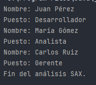

SAX (Simple API for XML) es un modelo de lectura secuencial de XML que genera eventos cada vez que se encuentra un nodo, un texto o un cierre de etiqueta. A diferencia de DOM, no mantiene en memoria el árbol completo del documento.

Tiene diferentes clases, algunas de las clases claves son:

SAXParserFactory - Fábrica para crear un parser SAX

SAXParser - Parser que interpreta el documento y dispara eventos

DefaultHandler -  Clase base donde se definen los métodos que responden a los eventos


### Eventos principales:

| `startDocument()`              | Al inicio del documento       |
| ------------------------------ | ----------------------------- |
| `startElement(...)`            | Cuando se abre una etiqueta   |
| `characters(char[], int, int)` | Cuando se detecta contenido   |
| `endElement(...)`              | Cuando se cierra una etiqueta |
| `endDocument()`                | Al finalizar el documento     |

## Ejemplo usando SAX:

```java
import javax.xml.parsers.SAXParser;
import javax.xml.parsers.SAXParserFactory;
import org.xml.sax.*;
import org.xml.sax.helpers.DefaultHandler;
import java.io.File;

public class SAXEjemplo {
    public static void main(String[] args) {
        try {
            File archivo = new File("datos/empleados.xml");
            SAXParserFactory factory = SAXParserFactory.newInstance();
            SAXParser parser = factory.newSAXParser();

            DefaultHandler handler = new DefaultHandler() {
                boolean nombre = false;
                boolean puesto = false;

                public void startElement(String uri, String localName, String qName, Attributes attributes) {
                    if (qName.equalsIgnoreCase("nombre")) nombre = true;
                    if (qName.equalsIgnoreCase("puesto")) puesto = true;
                }

                public void characters(char[] ch, int start, int length) {
                    if (nombre) {
                        System.out.println("Nombre: " + new String(ch, start, length));
                        nombre = false;
                    }
                    if (puesto) {
                        System.out.println("Puesto: " + new String(ch, start, length));
                        puesto = false;
                    }
                }

                public void endDocument() {
                    System.out.println("Fin del análisis SAX.");
                }
            };

            parser.parse(archivo, handler);
        } catch (Exception e) {
            System.out.println("Error SAX: " + e.getMessage());
        }
    }
}
```




En cuanto a SAX la memoria comparada con DOM es muy baja
su tipo de acceso es secuencial mientras que en DOM es aleatorio
SAX no nos permite modificar el XML y DOM si
SAX es algo mas complejo que DOM 
y  SAX es ideal para la lectura de archivos grandes

|Característica|SAX|DOM|
|---|---|---|
|Memoria|Muy baja|Alta|
|Tipo de acceso|Secuencial|Aleatorio (árbol completo)|
|Permite modificar XML|No|Sí|
|Complejidad|Media|Baja|
|Ideal para|Lectura de archivos grandes|Manipulación estructurada|
