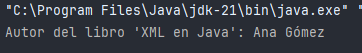

## JAXP

JAXP (Java API for XML Processing) es la API estándar de Java para trabajar con XML. Permite utilizar de forma flexible y unificada los modelos DOM, SAX o StAX a través de las clases de los paquetes `javax.xml.parsers`, `org.xml.sax`, `javax.xml.transform`, etc.

JAXP no es una biblioteca concreta, sino un conjunto de interfaces y fábricas que permiten elegir e intercambiar el parser XML subyacente.

## XPath

XPath (XML Path Language) es un lenguaje de consulta que permite navegar por documentos XML y localizar nodos en función de su nombre, atributos o estructura jerárquica. Es compatible con DOM y XSLT.

Con XPath podemos:

- Obtener nodos específicos sin recorrer el árbol completo.
    
- Consultar por condiciones (filtros).
    
- Acceder a atributos o texto interno.


|Expresión XPath|Resultado|
|---|---|
|`/libros/libro`|Todos los elementos `<libro>`|
|`//titulo`|Todos los nodos `<titulo>` del documento|
|`/libros/libro[1]`|Primer `<libro>` hijo de `<libros>`|
|`//libro[@id='L001']`|Libro con atributo `id = L001`|
|`//libro/titulo/text()`|Texto de todos los títulos de libros|

## Clases para XPath

|Clase|Descripción|
|---|---|
|`XPathFactory`|Fábrica para crear objetos XPath|
|`XPath`|Objeto principal para evaluar expresiones XPath|
|`XPathExpression`|Expresión compilada lista para ser evaluada|


## Ejemplo
### Consulta con XPath sobre DOM


```java
import javax.xml.parsers.DocumentBuilderFactory;
import javax.xml.parsers.DocumentBuilder;
import javax.xml.xpath.*;
import org.w3c.dom.*;

import java.io.File;

public class XPathEjemplo {
    public static void main(String[] args) {
        try {
            File archivo = new File("datos/libros.xml");
            DocumentBuilderFactory factory = DocumentBuilderFactory.newInstance();
            DocumentBuilder builder = factory.newDocumentBuilder();
            Document doc = builder.parse(archivo);

            XPathFactory xPathFactory = XPathFactory.newInstance();
            XPath xpath = xPathFactory.newXPath();

            XPathExpression expr = xpath.compile("//libro[titulo='XML en Java']/autor/text()");
            String autor = expr.evaluate(doc);

            System.out.println("Autor del libro 'XML en Java': " + autor);

        } catch (Exception e) {
            System.out.println("Error: " + e.getMessage());
        }
    }
}
```

```xml
<libros>  
    <libro>  
        <titulo>Java Avanzado</titulo>  
        <autor>Juan Pérez</autor>  
    </libro>  
    <libro>  
        <titulo>XML en Java</titulo>  
        <autor>Ana Gómez</autor>  
    </libro>  
</libros>
```


