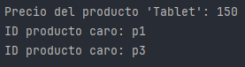

XPath es un lenguaje de navegación sobre documentos XML.
XPath nos permite localizar nodos como elementos, atributos o texto, dentro de documentos XML, a partir de expresiones que representan rutas y condiciones.

## En que lo utilizamos?

- DOM → para seleccionar nodos tras cargar el XML.
    
- XSLT → para aplicar transformaciones.
    
- Validaciones → reglas condicionales en estructuras XML.

# Sintaxis básica de XPath

| <span style="color:rgb(255, 174, 0)">Expresión</span> | <span style="color:rgb(255, 174, 0)">Significado</span> |
| ----------------------------------------------------- | ------------------------------------------------------- |
| `/libros/libro`                                       | Todos los nodos `<libro>` hijos de `<libros>`           |
| `//titulo`                                            | Todos los nodos `<titulo>` en todo el documento         |
| `//libro[1]`                                          | Primer nodo `<libro>` en cualquier parte del XML        |
| `//libro[@id='L002']`                                 | Nodo `<libro>` cuyo atributo id es “L002”               |
| `//libro[titulo='Java']`                              | Libro cuyo hijo `<titulo>` tiene el valor «Java»        |
| `//libro[position()=last()]`                          | Último libro en la colección                            |

# Clases clave en Java para XPath

| <span style="color:rgb(5, 255, 147)">Clase</span> | <span style="color:rgb(5, 255, 147)">Descripción</span>   |
| ------------------------------------------------- | --------------------------------------------------------- |
| `XPathFactory`                                    | Crea instancias de objetos XPath                          |
| `XPath`                                           | Evaluador de expresiones XPath                            |
| `XPathExpression`                                 | Expresión compilada lista para evaluación                 |
| `XPathConstants`                                  | Constantes de tipos de resultado (STRING, NODE, NODESET…) |

## Funciones XPath comunes

- `text()` → devuelve el contenido textual de un nodo
    
- `@atributo` → selecciona un atributo
    
- `position()` → devuelve la posición dentro del nodo padre
    
- `last()` → selecciona el último nodo
    
- `contains()` → busca coincidencia parcial
    
- `starts-with()` → filtro por prefijo

## Ejemplo

```java
import javax.xml.parsers.*;
import javax.xml.xpath.*;
import org.w3c.dom.*;

import java.io.File;

public class XPathAvanzado {
    public static void main(String[] args) {
        try {
            File archivo = new File("datos/catalogo.xml");

            DocumentBuilderFactory factory = DocumentBuilderFactory.newInstance();
            DocumentBuilder builder = factory.newDocumentBuilder();
            Document doc = builder.parse(archivo);

            XPathFactory xpf = XPathFactory.newInstance();
            XPath xpath = xpf.newXPath();

            // Buscar el precio del producto con nombre "Tablet"
            String precio = xpath.evaluate("//producto[nombre='Tablet']/precio/text()", doc);
            System.out.println("Precio del producto 'Tablet': " + precio);

            // Obtener los IDs de todos los productos que cuestan más de 100
            XPathExpression expr = xpath.compile("//producto[precio>100]/@id");
            NodeList nodos = (NodeList) expr.evaluate(doc, XPathConstants.NODESET);

            for (int i = 0; i < nodos.getLength(); i++) {
                System.out.println("ID producto caro: " + nodos.item(i).getTextContent());
            }

        } catch (Exception e) {
            System.out.println("Error XPath: " + e.getMessage());
        }
    }
}
```



## Ventajas

- Es muy expresivo y potente para búsquedas complejas.
- Nos permite una lógica condicional, que esta filtrado, seleccionado por atributos
- Reduce líneas de código frente a recorrer manualmente DOM
- Y es compatible con validadores XSLT, JAXB, DOM

## Limitaciones

- No nos modifica XML, solo nos localiza nodos
- Requiere un documento cargado en memoria, como puede ser DOM o similar
- El uso intensivo de XPath sobre documentos muy grandes puede ser menos eficiente que SAX