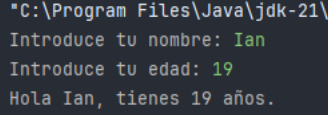
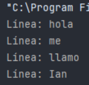
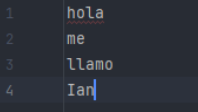
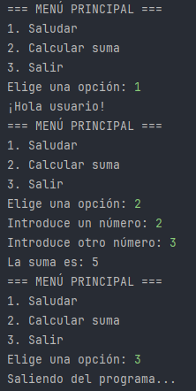
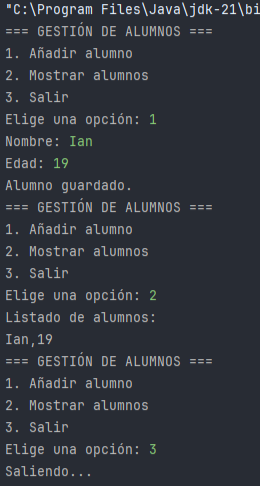

- Scanner pertenece a java.util y se usa para leer datos de distintas fuentes: teclado, archivos, cadenas o flujos de entrada (InputStream).  
      
    
- Su ventaja principal es la facilidad de uso: puede leer cadenas y números directamente, evitando conversiones manuales.  
      
    
- Muy útil en programas interactivos, educativos y proyectos con entrada de datos flexible.  
      
    

---

## Fundamentos

- Paquete: java.util  
      
    
- Tipos de datos que puede leer: int, double, String, etc.  
      
    
- Fuentes de entrada:  
      
    

- Teclado → new Scanner(System.in)  
      
    
- Archivo → new Scanner(new File("ruta.txt"))  
      
    
- Cadena de texto → new Scanner("texto inicial")  
      
    

---

## Métodos principales de Scanner


| Método       | Descripción                                 |
| ------------ | ------------------------------------------- |
| next()       | Lee la siguiente palabra (hasta espacio)    |
| nextLine()   | Lee una línea completa                      |
| nextInt()    | Lee un número entero                        |
| nextDouble() | Lee un número decimal                       |
| hasNext()    | Devuelve true si hay más datos disponibles  |
| hasNextInt() | Verifica si el siguiente token es un entero |
| close()      | Cierra el objeto Scanner                    |

---

## Uso de Scanner para leer desde teclado

### Ejemplo:

```java
import java.util.Scanner;

  

public class EjemploScanner {

    public static void main(String[] args) {

        Scanner sc = new Scanner(System.in);

  

        System.out.print("Introduce tu nombre: ");

        String nombre = sc.nextLine();

  

        System.out.print("Introduce tu edad: ");

        int edad = sc.nextInt();

  

        System.out.println("Hola " + nombre + ", tienes " + edad + " años.");

  

        sc.close(); // Siempre cerrar al final

    }

}
```

  



  

###  Explicación:

1. Scanner sc = new Scanner(System.in) → crea un objeto Scanner para leer desde teclado.  
      
    
2. nextLine() → lee toda la línea que escribe el usuario.  
      
    
3. nextInt() → lee un número entero directamente.  
      
    
4. Siempre cerrar el Scanner con sc.close() para liberar recursos.  
      
    
5. Nota importante: si mezclas nextInt() y nextLine(), hay que limpiar el buffer con un nextLine() extra.  
      
    

---

## Uso de Scanner para leer desde archivos

### Ejemplo:

```java

import java.io.File;

import java.util.Scanner;

  

public class LeerArchivoScanner {

    public static void main(String[] args) {

        try {

            File archivo = new File("datos/entrada.txt");

            Scanner sc = new Scanner(archivo);

  

            while (sc.hasNextLine()) {

                String linea = sc.nextLine();

                System.out.println("Línea: " + linea);

            }

  

            sc.close();

        } catch (Exception e) {

            System.out.println("Error al leer archivo: " + e.getMessage());

        }

    }

}
```



###  Explicación:

1. Se crea un File con la ruta del archivo.  
      
    
2. Se pasa ese archivo a un Scanner (Scanner sc = new Scanner(archivo)).  
      
    
3. hasNextLine() verifica si hay más líneas.  
      
    
4. nextLine() lee cada línea completa y la imprime.  
      
    
5. Cierra el Scanner al terminar.  
      
    

 Scanner permite leer palabras, números o líneas completas fácilmente, pero para archivos muy grandes, BufferedReader suele ser más eficiente.

---

## Creación de menús interactivos con Scanner

### Ejemplo:

```java
import java.util.Scanner;

  

public class MenuEjemplo {

    public static void main(String[] args) {

        Scanner sc = new Scanner(System.in);

        int opcion;

  

        do {

            System.out.println("=== MENÚ PRINCIPAL ===");

            System.out.println("1. Saludar");

            System.out.println("2. Calcular suma");

            System.out.println("3. Salir");

            System.out.print("Elige una opción: ");

            opcion = sc.nextInt();

  

            switch (opcion) {

                case 1:

                    System.out.println("¡Hola usuario!");

                    break;

                case 2:

                    System.out.print("Introduce un número: ");

                    int a = sc.nextInt();

                    System.out.print("Introduce otro número: ");

                    int b = sc.nextInt();

                    System.out.println("La suma es: " + (a + b));

                    break;

                case 3:

                    System.out.println("Saliendo del programa...");

                    break;

                default:

                    System.out.println("Opción inválida.");

            }

        } while (opcion != 3);

  

        sc.close();

    }

}
```

  



###  Explicación:

1. Menú en bucle do-while hasta que el usuario elija salir.  
      
    
2. nextInt() para leer la opción elegida.  
      
    
3. switch para ejecutar la acción correspondiente.  
      
    
4. Scanner cerrado al final con sc.close().  
      
    

 Base típica para menús de consola en FP y proyectos de aprendizaje.

---

## Comparación con otras clases de entrada


| Clase          | Ventajas                                | Inconvenientes                      |
| -------------- | --------------------------------------- | ----------------------------------- |
| Scanner        | Fácil de usar, soporta tipos primitivos | Más lento que BufferedReader        |
| BufferedReader | Muy eficiente en lectura de texto       | Necesita conversión manual de tipos |
| FileReader     | Lectura directa de archivos             | Requiere buffers para eficiencia    |

---

## Buenas prácticas

- Siempre cerrar Scanner (sc.close()).  
      
    
- Si mezclas nextInt() y nextLine(), limpiar buffer con nextLine().  
      
    
- Para proyectos grandes, combinar Scanner con POJOs para estructurar datos.  
      
    
- Evitar Scanner con archivos enormes; usar BufferedReader en su lugar.  
      
    

---

## Actividad práctica: Gestión de alumnos

### Código base:

```java
import java.io.*;

import java.util.*;

  

public class GestionAlumnos {

    public static void main(String[] args) {

        Scanner sc = new Scanner(System.in);

        int opcion;

  

        do {

            System.out.println("=== GESTIÓN DE ALUMNOS ===");

            System.out.println("1. Añadir alumno");

            System.out.println("2. Mostrar alumnos");

            System.out.println("3. Salir");

            System.out.print("Elige una opción: ");

            opcion = sc.nextInt();

            sc.nextLine(); // Limpiar buffer

  

            switch (opcion) {

                case 1:

                    try (FileWriter fw = new FileWriter("alumnos.txt", true);

                         BufferedWriter bw = new BufferedWriter(fw)) {

                        System.out.print("Nombre: ");

                        String nombre = sc.nextLine();

                        System.out.print("Edad: ");

                        int edad = sc.nextInt();

                        sc.nextLine();

  

                        bw.write(nombre + "," + edad);

                        bw.newLine();

                        System.out.println("Alumno guardado.");

                    } catch (IOException e) {

                        System.out.println("Error: " + e.getMessage());

                    }

                    break;

  

                case 2:

                    try (Scanner archivo = new Scanner(new File("alumnos.txt"))) {

                        System.out.println("Listado de alumnos:");

                        while (archivo.hasNextLine()) {

                            System.out.println(archivo.nextLine());

                        }

                    } catch (IOException e) {

                        System.out.println("Error: " + e.getMessage());

                    }

                    break;

  

                case 3:

                    System.out.println("Saliendo...");

                    break;

  

                default:

                    System.out.println("Opción no válida.");

            }

        } while (opcion != 3);

  

        sc.close();

    }

}
```

  



###  Explicación:

1. Menú interactivo para añadir o mostrar alumnos.  
      
    
2. FileWriter y BufferedWriter para guardar alumnos en un archivo.  
      
    
3. Scanner para leer alumnos desde el archivo.  
      
    
4. Limpieza del buffer con sc.nextLine() tras leer números.  
      
    
5. Cierre de recursos (try-with-resources y sc.close()) para evitar fugas.  
      
    

---


- Scanner es fundamental para leer datos de teclado, archivos o cadenas en Java.  
      
    
- Ideal para programas interactivos y menús de consola.  
      
    
- Fácil de usar en entornos educativos (DAM, FP).  
      
    
- Complementa a clases más eficientes como BufferedReader para proyectos grandes o archivos enormes.
    

